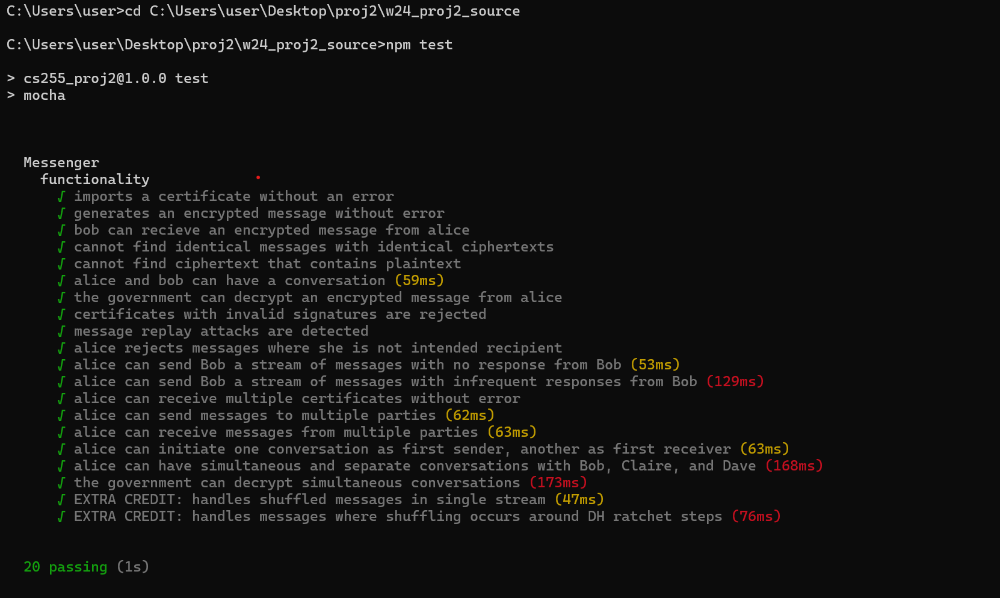

# End-to-End Encrypted Chat System

This repository contains the implementation of an end-to-end encrypted chat system using JavaScript. The system employs cryptographic techniques to ensure secure communication between clients, protecting the confidentiality and integrity of messages exchanged.
## Group Members
150182 Kipruto Isaac Kiprotich

## Features

- **Certificate Generation and Verification**: Generates and verifies certificates for secure key exchange.
- **ElGamal Key Exchange**: Utilizes ElGamal key pairs for secure key exchange.
- **Double Ratchet Algorithm**: Implements the Signal protocol’s double ratchet algorithm for forward secrecy and post-compromise security.
- **Authenticated Encryption**: Ensures messages are encrypted and authenticated, providing confidentiality and integrity.
- **Tamper Detection**: Detects and handles tampering attempts, terminating the program if any tampering is detected.

## Implementation Details

### Certificate Generation

The `generateCertificate` function generates an ElGamal key pair and creates a certificate containing the username and the public key. This certificate is used for secure key exchange with other clients.

### Certificate Verification

The `receiveCertificate` function verifies the authenticity of a certificate using the trusted central party’s public key. If the certificate is valid, it is stored for future communication; otherwise, the program terminates to prevent tampering.

### Sending Messages

The `sendMessage` function sets up the session using the double ratchet algorithm, generating new keys for each message. It encrypts the message with the new keys and creates a header containing encrypted key information for the recipient.

### Receiving Messages

The `receiveMessage` function sets up the session using the double ratchet algorithm and derives the necessary keys from the header information. It decrypts the message using the derived keys and handles any potential tampering attempts.

## Usage
###  Initialize the Messenger Client:

const messenger = new MessengerClient(certAuthorityPublicKey, govPublicKey);

### Generate a Certificate:
const certificate = await messenger.generateCertificate('username');

### Receive a Certificate:
await messenger.receiveCertificate(certificate, signature);

### Send a Message:
const [header, ciphertext] = await messenger.sendMessage('recipientUsername', 'Hello, world!');

### Receive a Message:
const plaintext = await messenger.receiveMessage('senderUsername', [header, ciphertext]);
### Dependencies
lib.js: Contains cryptographic primitives required for the implementation.

### Screenshot of the result

